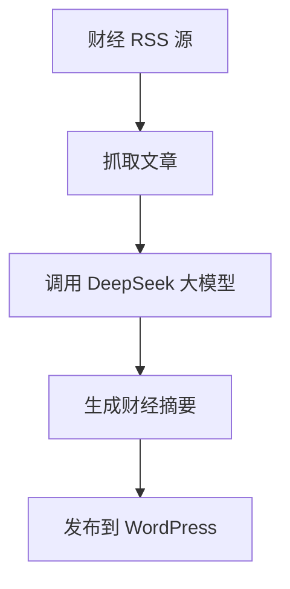

# 📈 Finance Inform · 每日财经速递

**为专业投资者打造的智能财经资讯助手**

---

## 🎯 项目简介

Finance Inform 是一款为券商分析师、基金经理、研究员等专业投资人量身打造的**财经资讯智能摘要助手**。

它自动聚合主流财经媒体的 RSS 信息源，并调用 **DeepSeek 大语言模型**，每天两次推送核心财经摘要，帮助你快速掌握全球市场动态、产业趋势与政策走向。

---

## 🚀 核心功能

- ⏰ **每日两次自动摘要推送**  
  每天上午 09:00、下午 17:00 定时运行，生成分析报告

- 🌐 **多源财经 RSS 聚合**  
  支持华尔街见闻、36 氪、东方财富、华尔街日报、BBC 等主流财经媒体

- 🧠 **大模型深度分析**  
  使用 DeepSeek 大语言模型自动提炼财经新闻的核心内容与趋势判断

- 📝 **WordPress 自动发布**  
  生成的财经摘要自动发布到你的 WordPress 网站

---

## 🧑‍💻 技术栈

- Python
- feedparser + newspaper3k
- DeepSeek 大语言模型 API
- GitHub Actions 自动定时部署
- WordPress REST API

---

## 🔧 快速开始（快速部署）

### 1. Fork 本项目

点击页面右上角的 **Fork** 按钮

### 2. 配置阿里云百炼 API Key

获取阿里云百炼 API Key：https://bailian.console.aliyun.com/

### 3. 在 GitHub 中设置 Secrets

进入你的 Fork 仓库 → **Settings** → **Secrets and variables** → **Actions** → **New repository secret**

添加以下 Secrets：

| Secret 名称 | 说明 | 示例 |
|------------|------|------|
| `OPENAI_API_KEY` | 阿里云百炼 API Key | `sk-xxxxxxxxxxxxxxxx` |
| `WP_SITE_URL` | WordPress 网站地址 | `https://your-site.com` |
| `WP_USERNAME` | WordPress 用户名 | `admin` |
| `WP_APP_PASSWORD` | WordPress 应用密码 | `xxxx xxxx xxxx xxxx` |

### 4. 创建 WordPress 应用密码

1. 登录 WordPress 后台
2. 进入 **用户** → **个人资料**
3. 滚动到 **应用程序密码** 部分
4. 输入名称：`Finance Inform Bot`
5. 点击 **添加新应用程序密码**
6. 复制生成的密码（仅显示一次，格式为 `xxxx xxxx xxxx xxxx`）

### 5. 自动触发 GitHub Actions

配置完成后，GitHub Actions 会自动运行。你也可以手动触发：

进入 **Actions** → **📡 RSS 财经新闻自动推送** → **Run workflow**

📌 成功部署后，每天两次财经摘要将自动生成并发布到你的 WordPress 网站！

---

## 💼 使用场景

- 券商/基金公司/研究所自动生成投资快报
- 金融从业者日常资讯监测
- 个人投资者快捷了解宏观政策/产业热点
- 财经内容运营/财经公众号 AI 辅助创作

---

## 📌 示例流程图

---

## 🛠️ 后续规划

- ✅ 增加更多 RSS 财经数据源
- ✅ 引入情绪分析与金融事件检测
- ⏳ 支持多语言财经摘要生成
- ⏳ 构建简洁前端页面用于非技术用户管理配置

---

## 🤝 欢迎参与

📬 欢迎 Star ⭐ / Fork 🍴 / PR 💡 本项目，一起共建更智能的财经决策工具。

你也可以通过 Issues 留言建议功能，或私信我交流使用体验～

---

© 2024-2026 | MIT License
